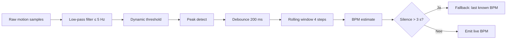
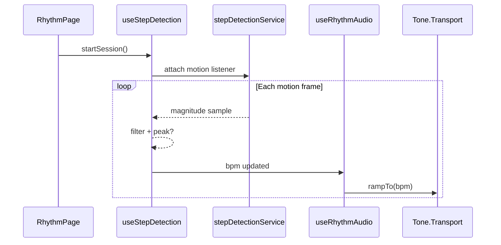
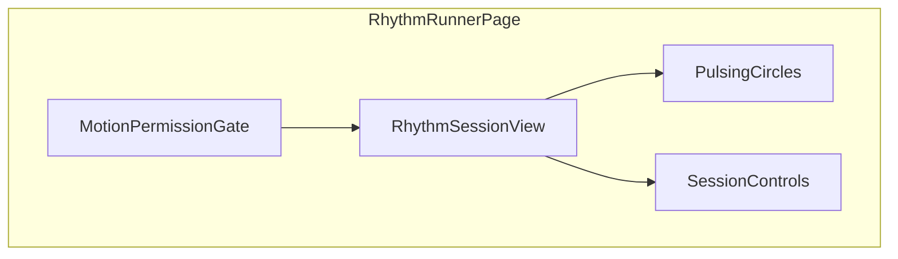

# Software Design Document (SDD) — RhythmRunner

| Veld | Waarde |
| :--- | :--- |
| **Documentversie** | 1.0 |
| **Applicatieversie** | 0.20.0 |
| **Status** | Concept — productdesign + geplande implementatie |
| **Laatst gegenereerd** | 2026-05-22 |
| **Repository** | `rythmrunner` |
| **Taal** | Nederlands (technische termen in gangbare Engelse vorm) |

---

## Documentbeheer

### Doel van dit document

Dit SDD beschrijft de volledige software-architectuur, technische keuzes, algoritmen en implementatieplan voor **RhythmRunner**: een mobiele webapplicatie die hardloopritme (BPM) detecteert via smartphone-sensoren en daarop real-time gegenereerde muziek synchroniseert.

### Doelgroep

- Product- en UX-stakeholders
- Frontend- en audio-engine developers
- QA / test engineers
- DevOps en release managers

### Relatie tot andere documentatie

| Document | Pad | Rol |
| :--- | :--- | :--- |
| Architectuurgids (repo) | `ARCHITECTURE.md` | Layering, path aliases, kwaliteitstools |
| Architectuur SSOT | `.cursor/rules/architecture/RULE.md` | Canonical import- en plaatsingsregels |
| Feature placeholder | `src/features/rhythm/README.md` | Huidige feature-scope |
| Doc index | `documentation/DOC_INDEX.md` | Navigatie naar overige docs |
| Changelog | `CHANGELOG.md` | Releasegeschiedenis |

### Implementatiestatus (snapshot 0.20.0)

| Onderdeel | Status |
| :--- | :--- |
| App shell (Vite, React, MUI, routing) | **Geïmplementeerd** |
| Feature `rhythm` (sensoren, audio, UI) | **Gepland** — alleen README-placeholder |
| Tone.js / midi soundfonts | **Gepland** — nog niet in `package.json` |
| Supabase / backend | **Verwijderd** uit fork (client-only PWA) |

---

## 1. Projectoverzicht & visie

### 1.1 Doelstelling

**RhythmRunner** is een innovatieve React-applicatie ontworpen voor mobiele webbrowsers (Progressive Web App-gedrag). Het hoofddoel is een ultieme *flow-state* bij hardlopers te creëren door muziek **real-time** te synchroniseren met hun fysieke loopritme (BPM).

Door gebruik te maken van de ingebouwde hardware-sensoren van de smartphone detecteert de app stappen en past de audio-engine de snelheid en gelaagdheid van gegenereerde muziek **direct en vloeiend** aan — zonder dat de beat uit de maat loopt.

### 1.2 Kernfunctionaliteiten

| # | Functionaliteit | Beschrijving |
| :---: | :--- | :--- |
| 1 | **Real-time stappendetectie** | Hardware-agnostische ritmebepaling via `DeviceMotionEvent` (lineaire versnelling). |
| 2 | **Vloeiende audio-aanpassing** | Dynamische BPM-pitching via `Tone.Transport` als master clock. |
| 3 | **Live synthese & layering** | Drumkit + dynamische pianolagen; complexiteit schaalt met tempo. |
| 4 | **Cold start** | Start op 60 BPM; bij signaalverlies blijft laatst bekend tempo actief. |
| 5 | **Synesthetische UI** | Pulserende overlappende cirkels gekoppeld aan volume/kleur per laag; controls fade-out. |

### 1.3 Niet-doelen (v1)

- Geen account/registratie of cloud-sync van runs.
- Geen integratie met Spotify/Apple Music (eigen synthese only).
- Geen wearables (Garmin/Apple Watch) in eerste release.
- Geen offline installatie vereist, wel **mobile-first** browser.

### 1.4 Succescriteria

- BPM-detectie stabiel binnen ±3 BPM bij constant tempo (3–6 min testloop).
- Geen hoorbare *phase drift* tussen drums en piano over 10+ minuten.
- UI blijft ≥ 30 fps tijdens actieve sessie op mid-range Android/iOS.
- Eerste interactie (tap → muziek) binnen 2 s na user gesture (Web Audio policy).

---

## 2. Tech stack & libraryselectie

De applicatie wordt gebouwd binnen een moderne, lichtgewicht en performante frontend-omgeving. Onderstaande tabel reflecteert **geïmplementeerde** dependencies (`package.json` v0.20.0) en **geplande** audio/sensor-libraries.

| Component | Technologie | Status | Reden van keuze |
| :--- | :--- | :---: | :--- |
| **Core framework** | React 19.2 | Live | Component-gestuurde UI, Concurrent features, brede ecosystem. |
| **Build tool** | Vite 7.2 | Live | Snelle HMR, geoptimaliseerde productie-builds voor mobiel. |
| **Package manager** | pnpm 9.15.4 | Live | Content-addressable store, strikt via `packageManager` veld. |
| **UI** | MUI 7.3 | Live | Theming, responsive layout, toegankelijke primitives. |
| **Routing** | React Router 7.11 | Live | Client-side routes; huidig één home-route. |
| **Server state** | TanStack Query 5.62 | Live | Provider aanwezig; rhythm-feature gebruikt primair **lokale** state. |
| **Audio engine** | Tone.js | Gepland | Web Audio wrapper met `Transport` master clock. |
| **Samples** | `midi-js-soundfonts` (gleitz) | Gepland | Gecomprimeerde browser-samples (piano, drums). |
| **Sensor API** | `DeviceMotionEvent` (native) | Gepland | Geen extra library; minimale latency. |
| **Testing** | Vitest 4 + Testing Library | Live | Unit/component tests voor pure services. |
| **Kwaliteit** | ESLint 9 + GTS + Prettier + dependency-cruiser | Live | Architectuurgrenzen afgedwongen in CI. |

> **Opmerking:** De oorspronkelijke draft vermeldde MUI v6; de repository gebruikt **MUI v7** conform `package.json`.

---

## 3. Hardware-interfacing & stappendetectie

### 3.1 Sensorbron en permissies

| Platform | API | Permissie |
| :--- | :--- | :--- |
| iOS Safari 13+ | `DeviceMotionEvent` | `requestPermission()` vereist na user gesture |
| Android Chrome | `DeviceMotionEvent` | Meestal zonder expliciete prompt |
| Desktop | Beperkt / geen betrouwbare motion | Niet-doelplatform voor v1 |

**Implementatieplaatsing (gepland):**

```
src/features/rhythm/
├── services/motionPermissionService.ts   # iOS permission flow
├── services/stepDetectionService.ts      # Pure signaalverwerking
├── hooks/useDeviceMotion.ts              # Event listener lifecycle
└── hooks/useStepDetection.ts             # React state + BPM output
```

### 3.2 Oriëntatie-onafhankelijkheid

Telefoonpositie (broekzak, hand, armband) mag de telling niet breken. Daarom wordt **3D vector magnitude** van lineaire versnelling gebruikt in plaats van één as:

$$a = \sqrt{x^2 + y^2 + z^2}$$

Waarbij $(x, y, z)$ de gefilterde versnellingscomponenten uit `accelerationIncludingGravity` of afgeleide linear acceleration zijn (exacte bronveld wordt gekalibreerd per device tijdens implementatie).

### 3.3 Signaalverwerking & peak detection

Pipeline in `stepDetectionService` (aangeroepen door `useStepDetection`):



| Stap | Parameter | Rationale |
| :--- | :--- | :--- |
| Low-pass | Cutoff ~5 Hz | Biologische max ~5 stappen/s |
| Dynamic threshold | Adaptief gemiddelde + marge | Compenseert rustige vs intense loop |
| Debounce | 200 ms | Voorkomt dubbele triggers (hak + teen) |
| Rolling window | Laatste 4 inter-step intervals | Gladde BPM zonder overmatige vertraging |
| Fallback timeout | 3 s zonder piek | Behoud flow; geen stilte in muziek |

### 3.4 BPM-berekening

$$\text{BPM} = \frac{60}{\text{gemiddelde tijd tussen stappen (s)}}$$

- **Cold start:** vaste 60 BPM tot eerste betrouwbare piek.
- **Fallback:** bij >3 s geen piek → laatst bekende BPM (geen reset naar 60).

### 3.5 Gyroscoop vs versnellingsmeter

De huidige branding/placeholder vermeldt *gyroscope data*. Voor **stappendetectie** is de versnellingsmeter (via `DeviceMotionEvent`) leidend in dit SDD. Gyroscopische rotatie kan in een latere iteratie worden toegevoegd voor aanvullende beat-articulatie of cadans-features, maar valt buiten de v1-kernpipeline.

---

## 4. Audio-architectuur & muziekgeneratie

### 4.1 Tone.js master clock

**Geen** `setInterval` / `setTimeout` voor muzikale timing — deze worden onderbroken door UI-rendering en achtergrond-throttling.

`Tone.Transport` fungeert als **single source of truth** voor tempo:

| Actie | Mechanisme |
| :--- | :--- |
| Tempo wijzigt | `Tone.Transport.bpm.rampTo(targetBpm, rampTime)` |
| Scheduling | `Tone.Transport.scheduleRepeat(callback, interval)` |
| Start na user gesture | `await Tone.start()` vanuit tap-handler |
| Stop / pauze | `Transport.stop()` + dispose bij unmount |

**Pitch-stabiliteit:** Individuele samples worden getriggerd op transport-ticks; tempo-wijziging past **interval** aan, niet ad-hoc `playbackRate` per hit (voorkomt drift tussen lagen).

### 4.2 Instrumentatie & layering

| Laag | Instrument | Gedrag vs BPM |
| :--- | :--- | :--- |
| **Rhythm** | Drumkit (samples) | Kick/snare/hihat-pattern; dichtheid stijgt met BPM |
| **Harmony** | Piano (soundfont) | Akkoorden/arp; extra voices boven drempel BPM |
| **Master** | Limiter / gain | Voorkomt clipping bij meerdere gelijktijdige voices |

**Geplande modules:**

```
src/features/rhythm/
├── services/audioEngineService.ts      # Tone context, Transport, dispose
├── services/drumPatternService.ts      # Pattern tables per BPM band
├── services/pianoLayerService.ts       # Layer unlock logic
├── hooks/useRhythmAudio.ts             # Bridge BPM → Transport
└── types/rhythm.types.ts               # BpmRange, LayerId, SessionState
```

### 4.3 Sample loading

- Bibliotheek: [`midi-js-soundfonts`](https://github.com/gleitz/midi-js-soundfonts) (of subset via CDN).
- Lazy load per instrument bij eerste sessie.
- Cache in memory; geen herhaalde fetch tijdens run.

### 4.4 Cold start & signaalverlies

| Scenario | Muziekgedrag |
| :--- | :--- |
| App start / tap Start | 60 BPM, basis drumloop |
| Eerste 4 stappen gedetecteerd | Ramp naar gemeten BPM (bijv. 300–800 ms) |
| Tijdelijk geen stappen (<3 s) | Houd laatste BPM |
| Langdurig geen stappen (>3 s) | Zelfde: geen reset (flow-state) |
| User Stop | Fade-out 500 ms → `Transport.stop()` |

### 4.5 Audio–sensor synchronisatie



---

## 5. UI/UX-design

### 5.1 Designprincipes

- **Minimal chrome:** Bediening verdwijnt na 3 s inactiviteit (opacity + pointer-events).
- **Synesthetische feedback:** Elke actieve laag = cirkel (radius ∝ volume, kleur ∝ layer ID).
- **Full viewport:** Geen scroll; safe-area insets voor notches.
- **Contrast:** Donkere achtergrond, lichte pulserende elementen (MUI theme tokens).

### 5.2 Geplande componentstructuur

```
src/features/rhythm/components/
├── RhythmSessionView.tsx      # Full-screen sessie
├── PulsingCircles.tsx         # Canvas/SVG circles
├── SessionControls.tsx        # Start/Stop (fade-out)
└── MotionPermissionGate.tsx   # iOS permission CTA
```



### 5.3 Toegankelijkheid

- Start-knop: minimaal 44×44 px touch target.
- `aria-live="polite"` voor BPM-wijzigingen (optioneel, debug mode).
- Respect `prefers-reduced-motion`: statische cirkels i.p.v. pulse.

---

## 6. Software-architectuur (applicatie)

### 6.1 Huidige entry points

| Bestand | Rol |
| :--- | :--- |
| `index.html` | Mobile viewport, Montserrat font, title |
| `src/main.tsx` | `ThemeProvider` + `CssBaseline` + `App` |
| `src/App.tsx` | `QueryProvider` → `BrowserRouter` → routes |
| `src/pages/HomePage.tsx` | Placeholder landing (v0.20.0) |

### 6.2 Layering (afgedwongen)

```
Pages → Components → Hooks → Services → Shared
```

**Belangrijkste dependency-cruiser regels:**

| Regel | Ernst | Betekenis |
| :--- | :---: | :--- |
| `no-circular` | error | Geen cyclische imports |
| `no-components-in-hooks` | error | Hooks importeren geen UI |
| `no-hooks-in-services` | error | Services zijn puur, geen React |
| `no-direct-service-in-feature-components` | warn | Components → hooks → services |

**Imports:** uitsluitend `@/` path aliases — geen `../` ketens.

### 6.3 Feature module `rhythm` (target)

```
src/features/rhythm/
├── README.md
├── docs/                    # optioneel diepgaande feature docs
├── components/
├── hooks/
├── services/
├── types/
└── utils/                   # optioneel
```

**Pagina:** `src/pages/RhythmRunnerPage.tsx` (of uitbreiding `HomePage`) — route registratie in `App.tsx`.

### 6.4 State management

| State type | Mechanisme |
| :--- | :--- |
| BPM, session actief, layers | React state in hooks |
| Audio graph | Singleton service module (geen global React context nodig) |
| Server/API data | TanStack Query (niet vereist voor v1 core loop) |

---

## 7. Dataflow & interfaces

### 7.1 Interne types (gepland)

```typescript
// src/features/rhythm/types/rhythm.types.ts (indicatief)

export type SessionPhase = "idle" | "arming" | "running" | "stopping";

export interface StepDetectionState {
  bpm: number;
  lastStepAt: number | null;
  isFallback: boolean;
  sampleRate: number;
}

export interface AudioLayerState {
  drumsActive: boolean;
  pianoVoices: number;
  masterGain: number;
}
```

### 7.2 Externe interfaces

| Interface | Protocol | Data |
| :--- | :--- | :--- |
| Device motion | DOM events | `accelerationIncludingGravity` samples |
| Soundfonts | HTTPS GET | Binary/audio buffers |
| Geen backend v1 | — | — |

---

## 8. Beveiliging, privacy & compliance

| Onderwerp | Maatregel |
| :--- | :--- |
| **Sensor data** | Verwerking 100% client-side; geen upload naar server |
| **Permissions** | Alleen motion na expliciete user actie (iOS) |
| **HTTPS** | Verplicht in productie (secure context voor Web Audio) |
| **Dependencies** | `pnpm` lockfile + CI audit pipeline |
| **Secrets** | Geen `.env` secrets nodig voor core feature v1 |

---

## 9. Performance & mobiele constraints

| Risico | Mitigatie |
| :--- | :--- |
| Main-thread blocking | Signaalverwerking in service; throttle UI updates (max 30 Hz) |
| Web Audio suspend | `Tone.start()` na gesture; visibility API resume handler |
| Battery drain | Stop listeners bij `sessionPhase !== running` |
| Grote soundfonts | Lazy load + cache; progress indicator bij eerste start |
| iOS low power mode | Documenteer beperkte sensor-rate in FAQ |

**Doelmetrieken:** zie §1.4.

---

## 10. Teststrategie

| Laag | Wat | Hoe |
| :--- | :--- | :--- |
| **Unit** | `stepDetectionService`, BPM math, debounce | Vitest met gesynthetiseerde magnitude-reeksen |
| **Unit** | `drumPatternService` pattern selectie | Tabel-gedreven tests per BPM band |
| **Component** | `MotionPermissionGate` | Testing Library + mock permission API |
| **Integration** | Hook + service | Mock `DeviceMotionEvent` |
| **Manual** | Echte device loops | Checklist: broekzak, hand, armband; 8/10/12 km/u |

Geen E2E browser farm in v1; focus op reproduceerbare pure functions (past bij complexity limits ESLint).

---

## 11. Deployment & CI

| Omgeving | Command | Output |
| :--- | :--- | :--- |
| Development | `pnpm dev` | `localhost:5173` |
| Production build | `pnpm build` | `dist/` static assets |
| Preview | `pnpm preview` | Lokale productie-simulatie |

**CI (`.github/workflows/ci.yml`):** type-check, lint, format, tests, build, architecture checks.

**Branching:** feature branches → `develop` → `main` (zie `.cursor/rules/workflow/RULE.md`).

---

## 12. Implementatieroadmap

| Fase | Deliverable | Afhankelijkheden |
| :---: | :--- | :--- |
| **0** | App shell, branding | ✅ 0.20.0 |
| **1** | `useDeviceMotion` + permission gate | iOS/Android devices |
| **2** | `stepDetectionService` + `useStepDetection` | Fase 1 |
| **3** | Tone.js integratie + Transport | User gesture policy |
| **4** | Drums + piano layers | Soundfont CDN |
| **5** | `PulsingCircles` + fade controls | Audio layer state |
| **6** | Polish, manual QA matrix | — |

---

## 13. Risico's & mitigaties

| Risico | Impact | Mitigatie |
| :--- | :---: | :--- |
| iOS sensor permission denied | Hoog | Duidelijke UX + instructies |
| Web Audio autoplay block | Hoog | Start alleen na tap |
| BPM jitter bij onregelmatige cadans | Medium | Rolling average + fallback |
| Tone.js bundle size | Medium | Tree-shake, lazy import |
| README vs SDD sensor term | Laag | Gyro → accel documentatie sync |

---

## Bijlage A — Woordenlijst

| Term | Definitie |
| :--- | :--- |
| **BPM** | Beats per minute; hardloopcadans |
| **Transport** | Tone.js master scheduler gekoppeld aan audio clock |
| **Fallback mode** | Behoud laatst bekende BPM bij sensorstilte |
| **Cold start** | Initiële 60 BPM vóór detectie |

## Bijlage B — Referenties

- [Tone.js Transport](https://tonejs.github.io/docs/latest/classes/Transport)
- [DeviceMotionEvent (MDN)](https://developer.mozilla.org/en-US/docs/Web/API/DeviceMotionEvent)
- [Web Audio API user activation](https://developer.mozilla.org/en-US/docs/Web/API/Web_Audio_API/Best_practices#autoplay_policy)
- Repository: `ARCHITECTURE.md`, `.dependency-cruiser.cjs`, `package.json`

---

*Dit document is gegenereerd door `scripts/generate_rhythm_runner_sdd.py`. Wijzig de bron in dat script en voer het opnieuw uit om de markdown te regenereren.*
